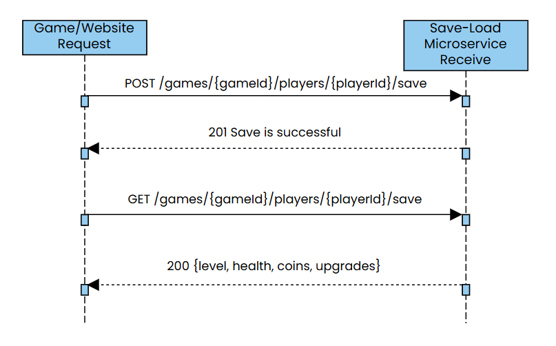

# Save Load Microservice README

## 1. Setup and Installation
Follow these steps to get the microservice running on your local machine:

* **Download the Branch**
* **Open project folder in VS Code**
* **Install flask Library in terminal**

```bash
pip install flask
```

## 2. Execution
Start the Microservice (Request)

1. Locate explorer and open `request.py`
2. Right-click the run at the top right and select "Run Python File in Dedicated Terminal".
3. You should see a message saying `Running on http://127.0.0.1:8000`


Run the Client (Receive)

1. Open `receive.py`
2. Open a second dedicated terminal
3. Run `receive.py`
4. You will see execution output, such as `201 {"message": "Save stored successfully..."}` and `201 {'message': 'Checkpoint saved successfully', 'status': 201}`

## 3. Request Data Call
GET
1. import requests
2. BASE = "http://localhost:8000"
3. res = requests.get(f"{BASE}/games/game/players/player123/save?slotId=slot1")

## 4. Receive Data Call
POST
* Checkpoint Autosave
1. checkpoint = {"levelsCompleted":[1,2,3],"health":90,"coins":100,"upgrades":{"locked":[],"unlocked":["shield","speed_boost"]}}
2. res = requests.post(f"{BASE}/games/{game_id}/players/{player_id}/checkpoint", json=checkpoint)


* Save Slots
1. data = {"levelsCompleted":[1,2],"health":100,"coins":50,"upgrades":{"locked":["double_jump"],"unlocked":["shield"]}}
2. res = requests.post(f"{BASE}/games/{game_id}/players/{player_id}/save?slotId=slot1", json=data)

## UML Sequence Diagram
